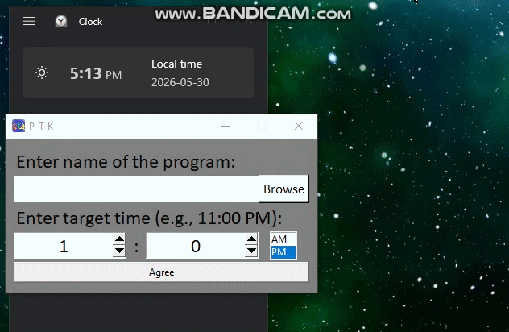
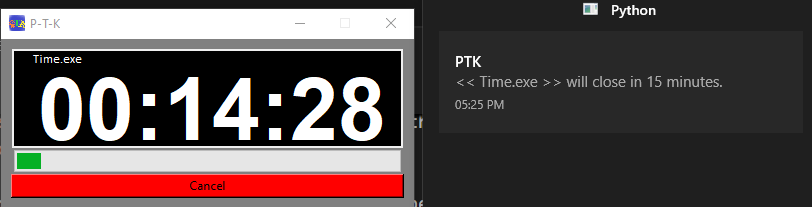
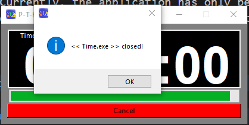

#  PTK (Process-To-Kill) 
| [Overview](https://github.com/erfaw/PTK#-overview) 
| [How to Run](https://github.com/erfaw/PTK#%EF%B8%8F-how-to-run) 
| [Features](https://github.com/erfaw/PTK#-features) 
| [Software Architecture](https://github.com/erfaw/PTK#software-architecture) 
| [Preview](https://github.com/erfaw/PTK#%EF%B8%8F-preview) 
| [What I Learned](https://github.com/erfaw/PTK#-what-i-learned) 
<!-- | [Download portable (Windows)](https://github.com/erfaw/PTK#download-portable-windows)  -->
|
   ## 📝 Overview 
   This project is a **desktop application** built with `Python` & `Tkinter` that ***helps users limit the amount of time spent using specific programs***. 
   
   It was originally created as a `personal productivity tool` to reduce gaming time and encourage better time management.

   Users can either type a process name manually or select one through the built-in `Browse` feature. The application creates a `countdown timer`, `sends notification reminders` before the time expires, and `automatically terminates the selected process` when the timer reaches zero.

   **NOTE** : Currently, the application has only been tested on Windows and must be run with administrator privileges in order to manage and terminate external processes.

   ---

   ## ▶️ How to Run
   1. Ensure you have Python installed.

   2. Clone the repository: 
      ```
      git clone https://github.com/erfaw/PTK
      ```

   3. Make Virtual Environment: 
      ```
      python -m venv .venv
      ```

      then on Git Bash: 
      ```
      source ./.venv/Scripts/activate
      ```

   4. Install dependencies: 
      ```
      pip install -r requirements.txt
      ```

   5. Run : 
      ```
      python main.py
      ```

   ---

   ## 🌟 Features

   * Set a `custom time limit` for any running application.
   * `Select a target program` by entering its `process name` or using the `Browse feature`.
   * Display a `live countdown timer` until the selected application is terminated.
   * Send `reminder notifications` <u>15 minutes</u> and <u>1.5 minutes</u> before the time limit expires.
   * Automatically `terminate` the target process when the timer reaches zero.
   * `Filter unrelated processes` from the `Browse list` to simplify program selection.
   * Designed and tested for `Windows` environments.
   * `Need administrator privileges` for managing external processes.

   ---

   ## Software Architecture

   I tried to project follows Object-Oriented Programming (OOP) principles and Separation of Concerns. Responsibilities are divided into dedicated Classes in separate modules:

   * **ProgramManager** – Process discovery, management, and termination.
   * **Timer** – Time calculations, formatting, and countdown management.
   * **Notification** – User notification delivery.
   * **GUI** – User interface, input handling, warnings, and timer visualization.

   These components are orchestrated by `main.py`, which acts as the application's entry point.

   ---

   ## 🖼️ Preview
   

   ### Sample Notification
   

   ### Sample Close MessageBox
   


   ---

   ## 💡 What I Learned 
   * Building a desktop application with Tkinter for a real-world personal use case.
   * Designing graphical user interfaces instead of relying solely on command-line applications.
   * Working with the Tk/Tcl event loop and understanding how GUI applications handle user interactions and scheduled tasks.
   * Managing and monitoring operating system processes programmatically.
   * Implementing countdown timers and time-based automation workflows.
   * Sending desktop notifications and integrating user reminders into applications.
   * Setting custom application icons and improving the overall user experience.
   * Applying Object-Oriented Programming (OOP) principles to structure a larger application.
   * Practicing Separation of Concerns by distributing responsibilities across dedicated modules.
   * Designing components that communicate with one another without relying on a single "God Object".
   * Building a more maintainable and scalable codebase through modular architecture.
   * Translating a personal productivity problem into a complete software solution.

   ---

   ## Command for pyinstaller
   ```
   .venv/Scripts/python -m PyInstaller \
    --onefile \
    --clean \
    --windowed \
    --uac-admin \
    --icon "icons/icon.ico" \
    --collect-all pandas \
    --collect-all plyer \
    --add-data "data:data" \
    --add-data "fonts:fonts" \
    --add-data "icons:icons" \
    main.py
   ```
   <!-- ## Download portable (Windows) -->
   <!-- Go to [Releases](https://github.com/erfaw/PTK/releases/tag/v1.0.0) → download `latest version`  -->
